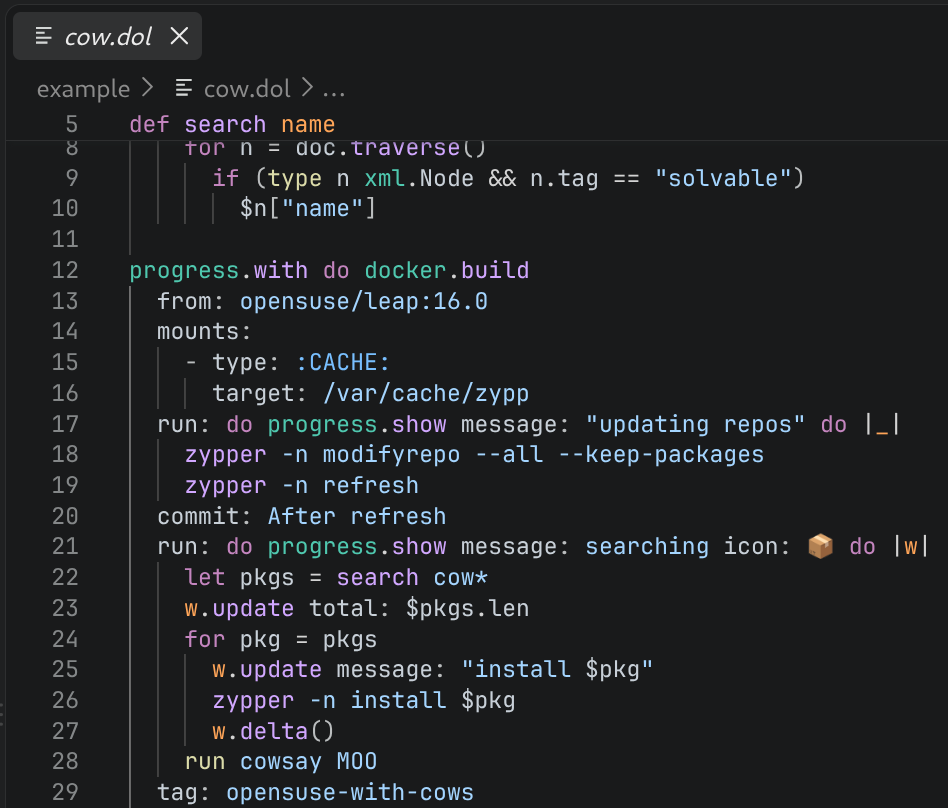
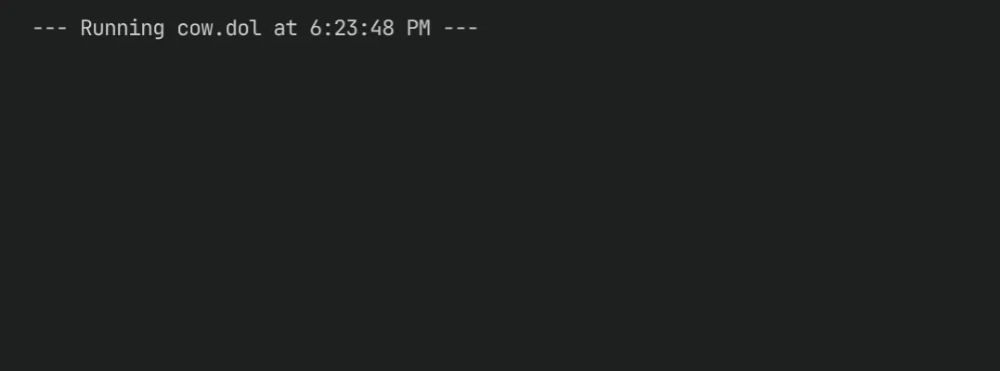

<p align="center">
  
</p>

Do is a scripting language for cross-platform CI/CD, DevOps, and automation. It
combines shell-like commands and indentation-oriented data declaration with
ordinary functions, structured concurrency, and remote-capable system APIs.

[Documentation](https://dolang-org.github.io/dolang/)

> **⚠️ Experimental:** Do is early and still taking shape — syntax, the
> standard library, and APIs are all subject to change, and it's not ready
> for production workloads. If the ideas below interest you, this is a good
> time to poke around, try things out, and weigh in.

## What Makes Do Different?

The interpreter stays local while a VFS context selects where system work
happens. The same function can operate on the local system, a container, an SSH
host, across WSL, or with administrator privileges. Filesystem access, external
programs, environment variables, system information, and security queries
follow the selected target — you don't write a different version of the
function for "local" versus "remote."

```
import fs sys

def inspect_target()
  echo "$(sys.os_info().os): $(fs.Path(".").canonical())"
  run hostname

inspect_target()

import ssh
ssh.with build.example.com do inspect_target()
```

VFS contexts compose, so the same model supports paths such as local → SSH host
→ container. APIs that are not VFS-forwarded continue to run in the interpreter
process.

## Also Included

- Structured concurrency: cancellation, channels, pipelines, and scoped
  resources.
- Enter containers, SSH hosts, WSL, `sudo`, or Windows UAC elevation without
  rewriting the function that performs the work.
- Work with Windows paths, access tokens, SIDs, ACLs, security descriptors,
  and native error codes alongside Unix identities and error codes.
- Styled terminal output and progress displays.
- Editor support: LSP server, Vim syntax definition, and a VS Code extension
  (build from source in [`dolang-code/`](./dolang-code); not yet on the
  Marketplace).
- Runs on Linux, macOS, Windows, and FreeBSD.

## Quick Look

<p align="center">
  
</p>

<p align="center">
  
</p>

## Included Modules

- **Automation and system integration:** processes, filesystems, containers,
  SSH, WSL, privilege elevation, argument parsing, systemd, XDG, progress, and
  terminal output.
- **Data and protocols:** HTTP, URLs, JSON, TOML, YAML, XML, SQLite, regex,
  base64, digests, zip, globbing, patches, and shell quoting.
- **Concurrency:** strands, cancellation, channels, pipelines, streams, and
  scoped resources.
- **Tooling:** compiler APIs, dynamic loading, the REPL, LSP, and VS Code
  extension.

## Try It

Install a bootstrap archive or build from source by following
[`BUILD.md`](./BUILD.md). Once installed, run the shell or an example:

```bash
dolang
dolang example/cow.dol
```

See the [Language Guide](https://dolang-org.github.io/dolang/language/)
or follow the
[command-line tool example](https://dolang-org.github.io/dolang/shell/cli-tools/).

## Acknowledgements

Do builds on a lot of excellent Rust ecosystem work.

- Vendored code: `hashbrown`
- Implementation inspiration: `vint64` by Tony Arcieri; `tiny-sort-rs` by Lukas
  Bergdoll
- Major building blocks: `tokio`, `reqwest`, `sqlite-plugin`, `libsqlite3-sys`,
  `linkme`, `annotate-snippets`, `tower-lsp`

Thanks to the authors and maintainers of these projects.

## License

Do is available under either of:

- Apache License, Version 2.0 ([LICENSE-APACHE](./LICENSE-APACHE))
- MIT license ([LICENSE-MIT](./LICENSE-MIT))

at your option.
